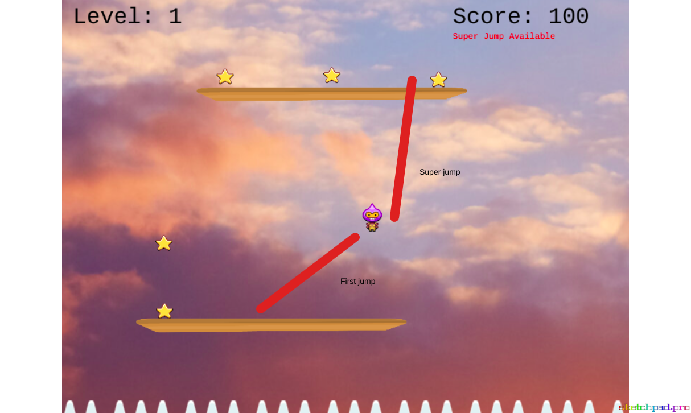

# 🌠 Star Fall 🌠

> Collect as many stars. Race against time. Everything moving faster and faster as your score goes up.
> Try to survive and collect stars as much as possible to bring your name into the high scores list.

- [Jump To: How To Use](#usage)
- [Jump To: Gameplay](#gameplay)
- [Jump To: How This Game Designed](#howdesigned)
- [Jump To: Tests](#tests)
- [Jump To: Future Features](#futurefeatures)
- [Jump To: Contributing](#contributing)

## Live Demo

[Live Demo Link](https://star-fall.netlify.app/)

## Built With

- JavaScript
- Phaser
- Webpack
- Netlify
- Jest

## ⭐ Getting Started ⭐

### Prerequisites

- A modern browser, up to date.
- Node.js, if you are going to use it in the local environment.
- A text editor.

### Usage

- Click the [Live Demo Link](https://star-fall.netlify.app/) and enjoy with the website.

### 🖥️ Running In The Local Environment

##### To run in the local environment first clone the repository(in Terminal):
- Clone the repository: `git clone https://github.com/kubilaycaglayan/star-fall.git`
- Enter the project directory: `cd star-fall`
- Run npm to install the dependencies `npm install`
- Start the game `npm run start`

 

### Gameplay

#### 🎮 Controls
##### Use arrow keys on your keyboard to play this game

- [Up: Jump / Super jump](#superjump)
- [Down: Pass through platform downwards](#passthrough)
- Left: Go left
- Right: Go right

### Logic
- The game has a leveling system that shifts up on every 100 points.
- In every level-up, ground creations and removal time intervals speeds up.
- Your objective is to survive with the highest possible score.
- The game has 20 levels on total.

### Super Jump

- After the character jumps from a platform, it can jump one more time in the air.

- You can only super jump if you have just jumped from a platform. This means, if you are falling, you can't use super jump.

### Go Down / Pass-Through

- You can pass through down from any platform to elevate down to the nearest platform. To do this use down arrow key when you are on a platform.

### Input Your Name

- And your score will be automatically recorded each time you finish the game.
- If you are on the top 10, you can see yourself in the list.

##### Remember to change your name, to do this click to the green text at the intro.

 

### 💼 How This Game Designed & Developed

#### Overview
> I wanted to create a platform game. With a movable character on a static window. It can jump and collect entities.

#### Story and Gameplay
>I don't like enemies, for that reason I wanted to make the game race against the time. To achieve this, I got some inspiration from an old game 'Icy Tower'. In that game the objective was to go as high as possible. Since I want to draw myself a frame, I kept my camera static. Which means the perspective is not changing. To make the game has an objective I put limitations like disappearing platforms and the game is ending if you fall down.

#### Level Design
>Also created a leveling system in which the time cycle of the platform moves faster as the level goes high. And levels depends on the stars collected. In every 100 points the game levels up, until 20. Which is a very fastly changing environment.

#### Assets Needed
> To achieve these objectives I collected the assets like the ground, background, star, a sprite sheet and I selected one of my improvisational guitar recordings as background music haha sorry for that. 😊

#### Technical
> To understand Phaser better and to overcome technical blockers quickly, I visited Phasers website and skim documentation.

 

### 🧪 Automated Tests

- Clone the repository: `git clone https://github.com/kubilaycaglayan/star-fall.git`
- Enter the project directory: `cd star-fall`
- Run npm to install the dependencies `npm install`
- Run tests with `npm run test`
- Tests are added for public methods.
- Mocks are also used for testing.

###  Future Features

- Platforms getting shorter as the level goes higher.
- Different themes.
- Better sound effect for collecting stars.

## Author

👤 **Kubilay Caglayan**

- Website: [kubilay](https://kubilaycaglayan.com)
- Github: [@kubilaycaglayan](https://github.com/kubilaycaglayan)
- Twitter: [@kbcaglayan](https://twitter.com/kbcaglayan)
- Linkedin: [linkedin](https://linkedin.com/in/kubilaycaglayan)

 

## 🤝 Contributing

Contributions, issues and feature requests are welcome!

Feel free to check the [issues page](https://github.com/kubilaycaglayan/star-fall/issues).

## Show your support

Give a ⭐️ if you like this project!

## Acknowledgements

- https://phasertutorials.com/creating-a-phaser-3-template-part-1/

## 📝 License

This project is [MIT](LICENSE) licensed.
